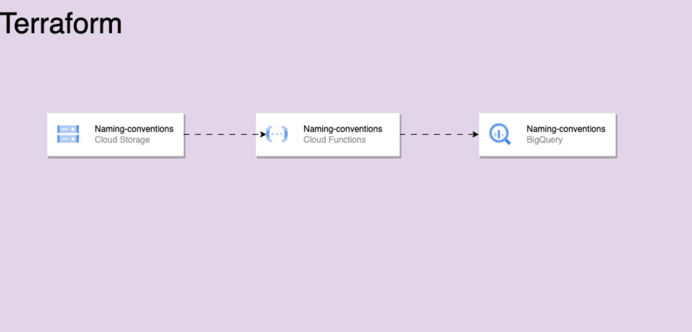

# terraform-gcp

## Description

This project setup two buckets, one cloud function and a bigquery dataset with Terraform.

## Requirements

You need to enable both [API Cloud Build](https://console.cloud.google.com/apis/api/cloudbuild.googleapis.com) & [Cloud Resource Manager](https://console.cloud.google.com/apis/api/cloudresourcemanager.googleapis.com) in your GCP Console.

To create the buckets you need to first run `terraform init` **WITHOUT** the cloud function in
the main.tf file.

## Goods to know

- The cloud function as a python runtime to perform an API request with urllib3.

  - The main.py file is compressed automatically, it's explained in the main.tf file of the cloud_function module.

- The bigquery_dataset module is downloading data's from a Google Sheet and insert it in a sheet dataset.

### Run :

1. terraform init
2. terraform plan (optional)
3. terraform apply

